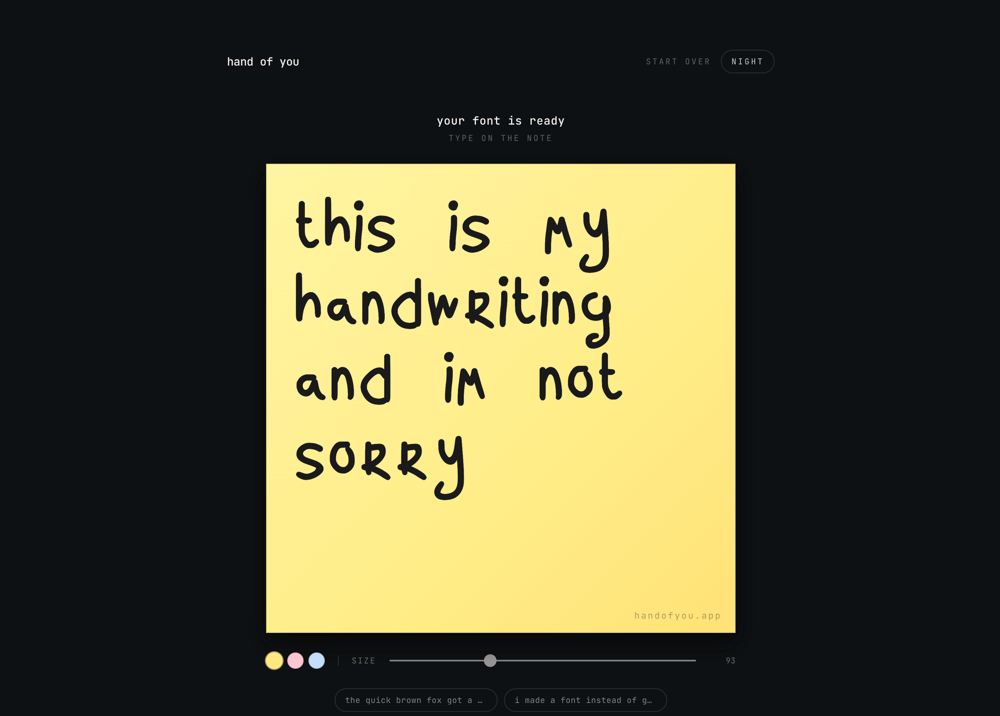
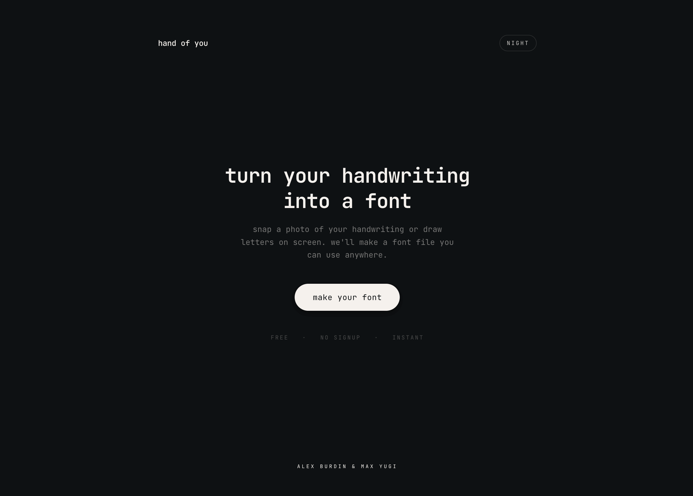
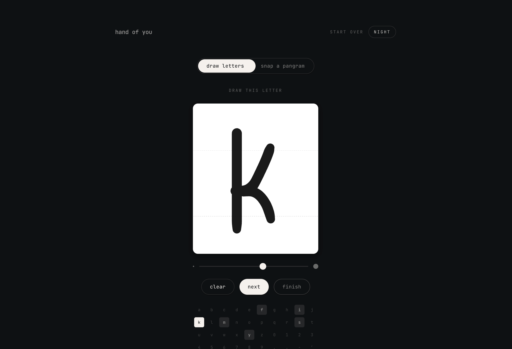

# Hand of You

Turn your handwriting into a font. Snap a photo of a pangram or draw letters on screen — get a real font file you can use anywhere.

<p align="center">
  
</p>

## Stack

- **Next.js** (app runs entirely in the browser + one API route)
- **Google Cloud Vision API** — character recognition from handwriting photos
- **esm-potrace-wasm** — bitmap-to-vector tracing (runs in browser via WASM)
- **opentype.js** — font generation (runs in browser)
- **Tailwind CSS v4**, **Framer Motion** — UI

## Getting Started

```bash
cd frontend
npm install
```

Create `frontend/.env.local` with your Google Vision API key:

```
GOOGLE_VISION_API_KEY=your-key-here
```

Then start the dev server:

```bash
npm run dev
```

Open [http://localhost:3000](http://localhost:3000).

## Environment Variables

| Variable | Required | Where | Description |
|---|---|---|---|
| `GOOGLE_VISION_API_KEY` | Yes | `.env.local` | Google Cloud Vision API key. Server-side only — never exposed to the browser. |

## How It Works

1. **Write** a pangram on paper or draw letters on screen
2. **Snap** a photo or upload an image
3. **Process** (all in-browser):
   - Preprocess image (grayscale, adaptive threshold, noise removal)
   - Recognize characters via Google Vision API
   - Vectorize each glyph bitmap (potrace WASM)
   - Generate OTF font (opentype.js)
4. **Type** with your new font, download .otf, or save text as an image

## Debug Mode

Add `?debug` to the URL (e.g. `http://localhost:3000/?debug`) and then process a photo or drawing. After the font is generated, a debug overlay will appear showing each pipeline stage (preprocessing, segmentation, vectorization, font generation) with intermediate images and timing data.

## Project Structure

```
frontend/
├── app/
│   ├── api/vision/    Google Vision API proxy (keeps key server-side)
│   ├── page.tsx       Main app page
│   └── layout.tsx     Root layout
├── components/        React components
├── lib/
│   ├── pipeline/      Full processing pipeline (preprocess → segment → vectorize → fontgen)
│   ├── fontLoader.ts  FontFace loader
│   └── pangrams.ts    Pangram collection
└── public/            Static assets
```

## Screenshots

<p align="center">
  
</p>

<p align="center">
  
</p>
